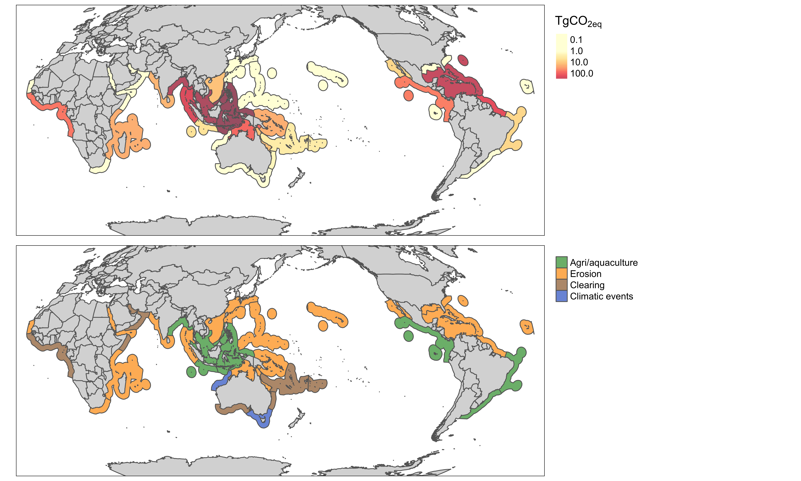

Future carbon emissions from global mangrove forest loss

Brown, Adame, Buelow, Holdorf and Turschwell

R code in support of the peer-reviewed paper

Please cite the paper if you use this code:

[Adame MF, Connolly RM, Turschwell MP, Lovelock CE, Fatoyinbo T, Lagomasino D, Goldberg LA, Holdorf J, Friess DA, Sasmito SD, Sanderman J. Future carbon emissions from global mangrove forest loss. Global Change Biology. 2021 Jun;27(12):2856-66.](https://onlinelibrary.wiley.com/doi/full/10.1111/gcb.15571)

If you want to explore this model, without having to use R, then check out [our interactive web app](https://mangrove-carbon.wetlands.app/).

The main script most users will be interested in is `emission_model.R` which has the functions for predicting emissions given
carbon storage, sequestration rate, mangrove area and deforestation rate.

`2020-04-19_emissions-scenarios` runs all of the emissions scenarios based on data per province in the data tables (with rates of deforestation calculated either from Goldberg et al. 2020 or Hamilton and Casey 2016, see two included csv files).
The scenarios represent the different scenarios for mangrove area and carbon storage described in the paper.

The other scripts are for creating the figures. Note to make the maps you'll need to get the [MEOW province shape files](https://data.unep-wcmc.org/datasets/38) (not included in this repo).
